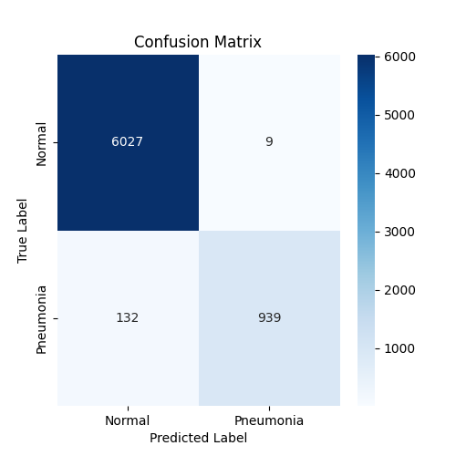

# Pneumonia Detection with Deep Learning
Deep learning for pneumonia detection 

## Overview
This project applies deep learning to detect pneumonia from chest X-ray images using fine-tuned ResNet50, DenseNet121, and a custom CNN model trained from scratch. The goal was to compare transfer learning vs. training a CNN from scratch and identify the best model for clinical deployment.

Through extensive experiments, ResNet50 emerged as the best-performing model, achieving high precision and the lowest false alarm rate, making it ideal for real-world medical applications.

## Dataset
### Sources
- NIH Chest X-ray Dataset (National Institutes of Health, 2017)
- Stanford PNA (Pneumonia) Dataset (CheXpert from Stanford University, 2019)
### Training Size
- 38,029 normal images from NIH data set
- 6,750 pneumonia images from NIH and Stanford
### Classes
- Nomal (0)
-  PNA (1)
### Preprocessing
- Images resized to 224×224
- Pixel values scaled to [0,1]
- Data Augmentation: rotation, shift, zoom, horizontal flip

## Model Selection & Training
### Resnet50
- A deep model with skip connections, making training more stable and accurate.
### Densenet121
- Leverages feature reuse, potentially better for medical images.
### Custom CNN (Baseline Model)
- Built from scratch to see if transfer learning is necessary.

All models utilized class weights for uneven distrubtion in images.
### Fine-Tuning Strategy
- Unfroze last 20 and 50 layers ResNet50 and DenseNet121 for fine-tuning.
- Adjusted learning rate (1e-5) to retain pre-trained ImageNet knowledge.
- Used Early Stopping & LR Reduction to prevent overfitting.

## Model Performance Comparison
| Metric           | Fine-Tuned ResNet50 (Best Model) | Fine-Tuned DenseNet121   | Baseline CNN |
| :---             |    :----:                        | ---:                     | ---:         |
| Precision (PPV)  | 99.05%                           | 79.26%                   | 79.11%       |
| Sensitivity      | 87.68%                           | 92.25%                   | 90.85%       |
| Specificity      | 99.85%                           | 95.74%                   | 95.74%       |
| F1 Score         | 92.87%                           | 85.02%                   | 84.57%       |

### Key Takeaways 
- ResNet50 has the highest Precision (99.05%) → Best at minimizing false alarms
- DenseNet121 has the highest Sensitivity (92.25%) → Best at detecting pneumonia cases.
- Baseline CNN performed decently but did not outperform transfer learning models.

## Final Model: ResNet50 Confusion Matrix

## Conclusion
This project demonstrates how deep learning can assist in pneumonia detection from chest X-rays. Through fine-tuning and decision threshold adjustments, I built a clinically relevant model with high accuracy and reliability. The final ResNet50 model balances Sensitivity and Precision, making it ideal for real-world deployment in medical imaging.

  

